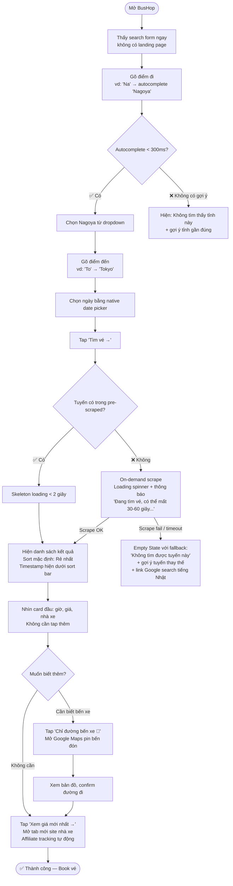
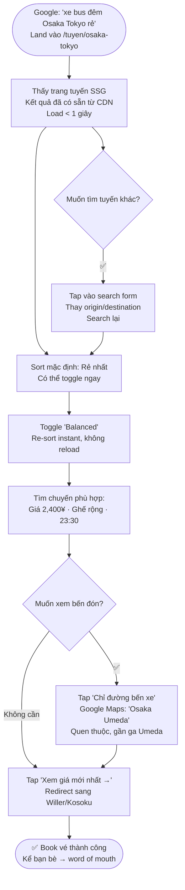
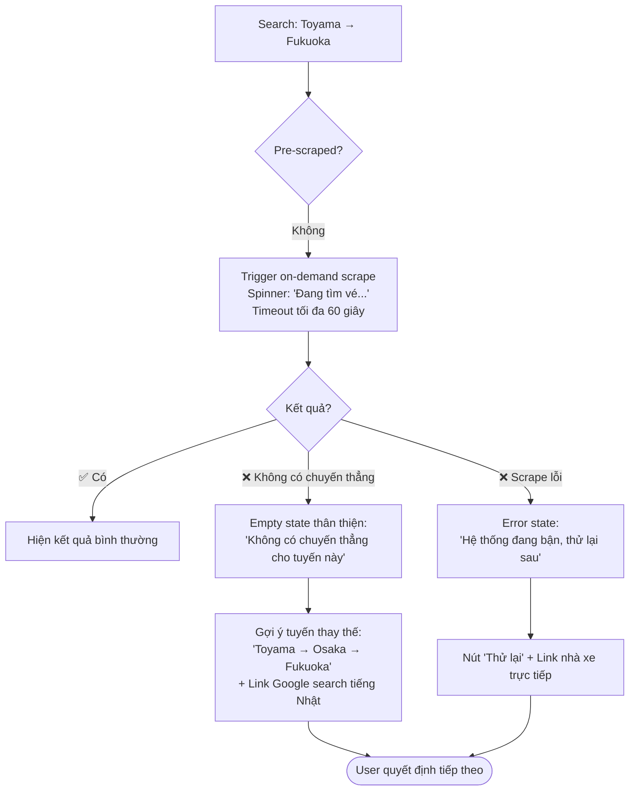

# UX Design Specification — Bushop

**Author:** bạn
**Date:** 2026-04-27

---

<!-- UX design content will be appended sequentially through collaborative workflow steps -->

## Executive Summary

### Project Vision

BusHop là webapp tổng hợp vé xe bus liên tỉnh tại Nhật dành cho ~500,000 người Việt đang sống, làm việc và du học tại Nhật Bản. Sản phẩm giải quyết rào cản ngôn ngữ và thông tin phân mảnh — người dùng hiện phải truy cập từng site nhà xe tiếng Nhật riêng lẻ hoặc hỏi qua group Facebook/Zalo. BusHop tập hợp dữ liệu từ nhiều nhà xe, hiển thị bằng tiếng Việt (ưu tiên), Nhật và Anh, cho phép so sánh nhanh theo 3 tiêu chí: Rẻ nhất, Nhanh nhất, Balanced.

### Target Users

- **Minh** — Công nhân kỹ thuật, 26 tuổi, lương 180,000 yên/tháng, đang để dành từng yên. Cần tìm vé rẻ nhanh, không biết tên bến xe tiếng Nhật, thường hỏi group Zalo 2 tiếng mới có người reply.
- **Lan** — Du học sinh, 22 tuổi, JLPT N4. Lần đầu đi xe bus đêm tại Nhật, lo lắng tìm bến, ngân sách eo hẹp, tìm kiếm qua Google tiếng Việt.
- Cộng đồng người Việt tại Nhật nói chung — lao động kỹ thuật, du học sinh, dekasegi.

### Key Design Challenges

1. **Rào cản ngôn ngữ** — Toàn bộ site nhà xe Nhật là tiếng Nhật; cần giao diện Việt-first thực sự, tên tỉnh hiển thị quen thuộc với người Việt.
2. **Tin tưởng data** — Scraping không realtime; cần thiết kế minh bạch để người dùng hiểu và tin tưởng thay vì bị nhầm lẫn về giá.
3. **Tìm bến xe** — Đặc biệt ban đêm, người mới rất dễ lạc bến; cần tích hợp chỉ đường trực tiếp.
4. **Mobile-first tốc độ** — Người dùng chủ yếu dùng điện thoại; cần ≤ 3 taps từ mở app đến thấy kết quả.

### Design Opportunities

1. **Tiếng Việt first** — Không competitor nào cung cấp thông tin xe bus Nhật bằng tiếng Việt — lợi thế cạnh tranh bền vững.
2. **Transparent trust** — Hiển thị timestamp cập nhật rõ ràng thay vì fake realtime — biến điểm yếu thành differentiator về độ tin cậy.
3. **Google Maps deep link** — Giải quyết nỗi đau tìm bến mà không cần build bản đồ riêng.
4. **3-tier sort đơn giản** — Toggle Rẻ nhất / Nhanh nhất / Balanced — UI đơn giản hơn bất kỳ app bus Nhật nào hiện tại.

## Core User Experience

### Defining Experience

Hành động cốt lõi: **Gõ tỉnh đi → tỉnh đến → chọn ngày → thấy kết quả giá rẻ nhất trong ≤3 taps.** Mọi quyết định UX đều phục vụ flow này — không có gì được làm chậm hoặc phức tạp hóa nó.

### Platform Strategy

- **Mobile-first web app** — không native app giai đoạn 1; PWA nếu cần sau
- **Touch-based primary** — tối ưu cho ngón tay cái, tap target ≥ 44px
- **Màn hình 375px trở lên** — iPhone SE là baseline
- **Chrome/Safari iOS/Android** — 2 phiên bản gần nhất
- **Không cần offline** — data scraping cần online

### Effortless Interactions

- **Autocomplete tên tỉnh tiếng Việt** — gõ "To" ra "Tokyo", không cần biết tiếng Nhật
- **Chọn ngày bằng date picker native** — không custom calendar phức tạp
- **Sort toggle 1 tap** — Rẻ nhất / Nhanh nhất / Balanced, không cần reload
- **"Chỉ đường đến bến" 1 tap** — mở thẳng Google Maps, không copy-paste địa chỉ

### Critical Success Moments

- **Thấy kết quả trong 3 giây** — nếu chậm hơn, user bỏ đi
- **Giá hiển thị rõ ngay trên card** — không cần tap vào mới thấy giá
- **Click "Xem giá mới nhất"** → mở đúng trang nhà xe đúng chuyến — không lạc trang
- **Lần đầu dùng thành công** → bookmark → không hỏi group Zalo nữa

### Experience Principles

1. **Tiếng Việt trước, tiếng Nhật sau** — giao diện mặc định tiếng Việt, tên tỉnh hiển thị quen thuộc, mọi label/nút/thông báo đều Việt-first
2. **Ít bước nhất có thể** — mỗi step thừa là 1 user bỏ đi
3. **Minh bạch hơn là hoàn hảo** — hiện timestamp thật thay vì fake realtime
4. **Mobile thumb-friendly** — nút quan trọng nằm vùng tay cái, tap target ≥ 44px

## Desired Emotional Response

### Primary Emotional Goals

**Cảm xúc chính: Nhanh + Thỏa mãn** — User hoàn thành việc tìm vé trong vài giây, cảm giác "xong rồi, không cần hỏi ai nữa." Đây là cảm giác của người tự giải quyết được vấn đề mà trước đây phải phụ thuộc vào người khác.

### Emotional Journey Mapping

| Giai đoạn | Cảm xúc mong muốn |
|---|---|
| Mở app lần đầu | Quen thuộc, không xa lạ — giao diện tiếng Việt ngay |
| Gõ tìm kiếm | Tự tin — autocomplete gợi ý đúng tỉnh mình muốn |
| Thấy kết quả | Thỏa mãn — giá rõ ràng, so sánh được ngay |
| Click "Xem giá mới nhất" | Nhẹ nhõm — đúng trang, đúng chuyến |
| Khi có lỗi / không có kết quả | Không bực bội — thông báo rõ + gợi ý thay thế |
| Lần sau quay lại | Tự nhiên — như reflex, không cần nghĩ |

### Micro-Emotions

- **Tự tin** (không Bối rối) — autocomplete, label rõ ràng tiếng Việt
- **Thỏa mãn** (không Thất vọng) — kết quả load nhanh, giá hiển thị ngay
- **Tin tưởng** (không Hoài nghi) — timestamp minh bạch, không fake realtime
- **Quen thuộc** (không Xa lạ) — ngôn ngữ và tên tỉnh thân quen

### Design Implications

- **Nhanh** → Kết quả mặc định sort "Rẻ nhất", không cần user thêm bước
- **Thỏa mãn** → Giá to, đậm, nhìn thấy ngay không cần scroll hay tap
- **Tự tin** → Autocomplete phản hồi < 300ms, không để user chờ
- **Không bực bội** → Empty state luôn có gợi ý thay thế, không dead end

### Emotional Design Principles

1. **Mỗi giây chờ là 1 điểm tin tưởng mất đi** — ưu tiên tốc độ tuyệt đối
2. **Thông tin đủ để quyết định trong 1 lần nhìn** — không ẩn thông tin quan trọng sau tap
3. **Không bao giờ để user vào ngõ cụt** — mọi error state đều có lối thoát

## UX Pattern Analysis & Inspiration

### Inspiring Products Analysis

**Google Flights:**
- Search form đơn giản nằm trên đầu, kết quả hiện ngay bên dưới — không chuyển trang
- Giá hiển thị to, đậm, màu nổi — nhìn 1 lần biết ngay rẻ hay đắt
- Filter gọn, không overwhelm — chỉ hiện filter phổ biến nhất

**Skyscanner:**
- Sort toggle nhanh: Rẻ nhất / Nhanh nhất / Tốt nhất — không cần dropdown
- Result card compact: airline + giờ + giá — đủ để quyết định, tap vào mới thấy thêm
- Timestamp "Cập nhật X phút trước" — minh bạch về data freshness

### Transferable UX Patterns

**Navigation:**
- Search form + results trên cùng 1 trang (không chuyển trang) → giảm 1 step cho BusHop
- URL cập nhật theo search params → shareable link, SEO tốt

**Interaction:**
- Sort toggle 3 nút ngang (không dropdown) → 1 tap → áp dụng cho Rẻ nhất/Nhanh nhất/Balanced
- Result card compact mặc định, expand khi tap → phù hợp mobile, không scroll dài

**Visual:**
- Giá to, đậm, màu accent → mắt tìm thấy ngay
- Timestamp nhỏ, subtle → có mặt nhưng không distract

### Anti-Patterns to Avoid

- **Quá nhiều filter ngay từ đầu** → BusHop chỉ show 3 filter chính (giờ/ghế/nhà xe)
- **Modal booking trong app** → redirect thẳng ra site gốc, không giả vờ booking
- **Fake "Còn X ghế"** → chỉ hiện số ghế thật từ scraper, không FOMO giả

### Design Inspiration Strategy

**Adopt:**
- Sort toggle 3 nút ngang từ Skyscanner
- Timestamp data freshness từ Skyscanner
- Giá to, đậm, màu nổi từ Google Flights

**Adapt:**
- Result card compact → thêm Google Maps button ngay trên card
- Search form → thay airport bằng tên tỉnh tiếng Việt quen thuộc

**Avoid:**
- Filter phức tạp ngay màn đầu
- Bất kỳ thứ gì fake realtime

## Design System Foundation

### Design System Choice

**shadcn/ui + Tailwind CSS** — Themeable system với foundation mạnh, tích hợp native vào Next.js 14 App Router.

### Rationale for Selection

- **Tốc độ MVP** — Components copy-paste sẵn dùng, không mất thời gian build từ đầu
- **Tailwind đã có sẵn** — create-next-app đã cài, không cần setup thêm
- **Không lock-in** — shadcn/ui không phải npm package, code nằm trong project, toàn quyền chỉnh sửa
- **Accessible mặc định** — Components dùng Radix UI primitives, ARIA đúng chuẩn
- **Team nhỏ, 2-3 người** — Một người lo UI, không cần design system phức tạp

### Implementation Approach

- Cài shadcn/ui CLI: `npx shadcn@latest init`
- Dùng các components cần thiết: Button, Input, Select, Card, Badge, Skeleton (loading state)
- Không cài toàn bộ — chỉ add từng component khi cần (YAGNI)

### Customization Strategy

**Color Palette — Warm Kem & Sakura**

Nền kem ấm, card trắng với shadow vàng nhẹ, accent sakura hồng. 80% neutral ấm, 15% primary xanh đậm, 5% accent — thân thiện, gần gũi, không lạnh.

| Token | Hex | Dùng cho |
|---|---|---|
| Primary | `#1A3660` | Header, nút chính CTA filled |
| Primary hover | `#243E72` | Hover state nút primary |
| Accent | `#D4607A` | Giá vé, badge "Rẻ nhất", link |
| Accent muted | `#C67B5C` | Label phụ, eyebrow text |
| Background | `#FEF9F0` | Nền trang, input background |
| Surface | `#FFFFFF` | Card, header |
| Border | `#F0E8D8` | Divider, card border, input border |
| Border focus | `#D4607A` | Input focus ring |
| Border hover | `#E8C8A0` | Card hover border |
| Text primary | `#1A1008` | Tiêu đề, nội dung chính |
| Text secondary | `#78604A` | Meta info, nhà xe |
| Text muted | `#A08060` | Label field, timestamp, lang switcher |
| Text placeholder | `#C4B09A` | Placeholder input |
| Success | `#0D9488` | Ghế còn nhiều |
| Warning | `#F57C3A` | Ghế sắp hết (dùng kèm icon) |

**Typography:**
- Font: **Be Vietnam Pro** — thiết kế riêng cho tiếng Việt, hỗ trợ dấu sắc/huyền/nặng/hỏi/ngã tốt hơn Inter ở font size nhỏ trên mobile
- Fallback: `Noto Sans, sans-serif`
- Google Fonts: `Be Vietnam Pro:wght@300;400;500;600;700;800`
- Font size mobile tối thiểu: 16px (NFR19)
- Giá vé: font-size 24-26px, font-weight 800, màu Accent `#D4607A`
- Tên thời gian: font-size 24px, font-weight 800, color Text primary

**Spacing & Shape:**
- Border radius card: 18-20px — bo to, thân thiện
- Border radius input: 12px
- Border radius button: 14px (primary), 10px (action trong card)
- Border radius sort bar: 12px với pill 9px bên trong
- Card shadow: `0 4px 24px rgba(180,120,60,0.10), 0 1px 4px rgba(180,120,60,0.06)` — ấm, không lạnh
- Card hover shadow: `0 8px 24px rgba(180,120,60,0.12)` + `translateY(-2px)`
- Card hover border: `#E8C8A0`
- Tap target tối thiểu: 44px (NFR, mobile thumb-friendly)
- Card padding: 16px
- Divider icon swap (⇅) giữa 2 input: 30px circle với border `#E8DDD0`

## Core User Experience — Defining Experience

### 2.1 Defining Experience

> **"Tìm vé bus rẻ nhất từ Tokyo đi Osaka ngày mai — trong 3 giây."**

Đây là câu người dùng BusHop sẽ nói với bạn bè. Không phải "đặt vé", không phải "so sánh nhà xe" — chỉ đơn giản là **tìm thấy giá rẻ nhất nhanh nhất**. Mọi thứ khác phục vụ khoảnh khắc này.

### 2.2 User Mental Model

**Người dùng hiện tại làm thế nào:**
- Hỏi group Zalo → chờ 2 tiếng → nhận link tiếng Nhật → không hiểu → bỏ cuộc hoặc book bừa
- Vào thẳng Willer Express → toàn tiếng Nhật → không biết chọn bến nào

**Mental model họ mang theo:**
- Quen với Google Flights, Skyscanner → kỳ vọng: gõ điểm đi/đến → thấy danh sách giá ngay
- Tên tỉnh tiếng Việt: "Tokyo", "Osaka" — không phải "東京", "大阪"
- Giá là số quan trọng nhất — phải to, rõ, thấy ngay

**Điểm dễ bị confuse:**
- Bến xe đón khách (không phải ga tàu) — cần Google Maps ngay trên card
- Data có thể cũ — cần timestamp rõ ràng để không bị nhầm

### 2.3 Success Criteria

- Gõ xong tên tỉnh trong ≤ 2 taps (autocomplete)
- Thấy kết quả đầu tiên trong ≤ 3 giây
- Nhìn card biết ngay: giờ đi, giờ đến, giá, nhà xe — không cần tap thêm
- Click "Xem giá mới nhất" → mở đúng trang đúng chuyến trong ≤ 2 giây

### 2.4 Novel vs. Established Patterns

**Established (dùng nguyên):**
- Search form origin → destination → date: người dùng đã biết từ Google Flights
- Sort toggle 3 nút: Skyscanner đã educate người dùng

**Novel (BusHop riêng):**
- **Tên tỉnh tiếng Việt** trong autocomplete — không app nào làm
- **Timestamp + CTA "Xem giá mới nhất"** thay vì "Đặt vé" — honest pattern
- **Google Maps button ngay trên card** — không cần vào detail page

### 2.5 Experience Mechanics

**1. Initiation:**
- User mở app → thấy ngay search form (không landing page, không onboarding)
- Placeholder: "Đi từ đâu?" / "Đến đâu?" — tiếng Việt

**2. Interaction:**
- Gõ 2-3 ký tự → autocomplete dropdown tiếng Việt xuất hiện < 300ms
- Chọn ngày bằng native date picker
- Tap "Tìm vé" → skeleton loading → kết quả hiện ra (sort Rẻ nhất mặc định)
- Tap sort toggle → re-sort instant, không reload

**3. Feedback:**
- Skeleton loading trong lúc chờ (không spinner trắng trơn)
- Timestamp "Cập nhật lúc 14:30" subtle dưới danh sách
- Giá màu Accent `#D4607A`, to 20px — mắt tìm thấy ngay

**4. Completion:**
- User tap "Xem giá mới nhất →" → mở tab mới trang nhà xe đúng chuyến
- Affiliate tracking tự động qua query params, user không thấy

## Visual Design Foundation

### Color System

Palette **Warm Kem & Sakura** — accessibility check (contrast vs `#FEF9F0`):

| Token | Hex | Contrast vs Background | Pass AA? |
|---|---|---|---|
| Primary `#1A3660` | Xanh đậm | 10.8:1 | ✅ AAA |
| Accent `#D4607A` | Sakura rose | 4.7:1 | ✅ AA |
| Text primary `#1A1008` | Nâu đen | 17.8:1 | ✅ AAA |
| Text secondary `#78604A` | Nâu vừa | 5.2:1 | ✅ AA |
| Text muted `#A08060` | Nâu nhạt | 3.4:1 | ⚠️ chỉ dùng cho label/placeholder |
| Success `#0D9488` | Teal | 4.5:1 | ✅ AA |
| Warning `#F57C3A` | Cam | 3.1:1 | ⚠️ dùng kèm icon, font-weight 700 |

### Typography System

| Scale | Size | Weight | Dùng cho |
|---|---|---|---|
| Display | 28px | 700 | Tiêu đề trang chủ |
| H1 | 24px | 700 | Tên tuyến, heading chính |
| H2 | 20px | 600 | Giá vé (màu Accent) |
| H3 | 18px | 600 | Tên nhà xe |
| Body | 16px | 400 | Nội dung chính, label |
| Small | 14px | 400 | Timestamp, meta info |
| Tiny | 12px | 400 | Badge, tag |

- Font: **Be Vietnam Pro** (Google Fonts, free, thiết kế riêng cho tiếng Việt — tốt hơn Inter cho dấu tiếng Việt ở size nhỏ trên mobile). Fallback: `Noto Sans, sans-serif`
- Line height: 1.5 cho body, 1.2 cho heading
- Letter spacing: 0 cho body, -0.03em cho heading lớn và giá tiền

### Spacing & Layout Foundation

- **Base unit: 4px** — mọi spacing là bội số của 4
- **Spacing scale:** 4 / 8 / 12 / 16 / 24 / 32 / 48 / 64px
- **Max content width:** 640px (mobile-first)
- **Card padding:** 16px
- **Section gap:** 24px
- **Grid:** 1 cột mobile, 2 cột tablet

### Accessibility Considerations

- Font size tối thiểu 16px — không bao giờ dùng < 14px
- Tap target tối thiểu 44×44px
- Focus ring rõ ràng cho keyboard navigation
- Không dùng màu đơn thuần để truyền thông tin — luôn kèm icon hoặc text
- Warning `#F57C3A` chỉ dùng với font-weight 700 để đạt contrast

## Design Direction Decision

### Design Directions Explored

9 directions được khám phá qua 2 vòng HTML showcase interactive:

**Vòng 1** — `ux-design/design-directions.html`:

| Direction | Tên | Đặc điểm |
|---|---|---|
| A | Minimal Clean | Trắng tinh, focus kết quả, Google Flights inspired |
| B | Card Heavy | Header xanh đậm, border accent trái, nhiều thông tin trên card |
| C | Fuji Themed | Gradient Phú Sĩ, search card nổi, sakura accent |
| D | App Bottom Nav | Bottom navigation bar, cảm giác native app |
| E | Dark Mode Premium | Nền tối xanh đêm, blue accent |
| F | Compact List | Dense row-based layout, tap-to-expand |

**Vòng 2** — `ux-design/mockup-3-styles.html`:

| Direction | Tên | Đặc điểm |
|---|---|---|
| G · Night Fuji | Glassmorphism Dark | Nền tối xanh đêm, glass card blur, ambient blob sakura |
| H · Warm Soft | **✅ CHOSEN** | Nền kem `#FEF9F0`, card bo to 18-20px, shadow vàng ấm |
| I · Bold Type | Bold Type-First | Trắng tinh, border đen 2px, typography 28-32px, editorial |

### Chosen Direction

**Direction H — Warm Soft Card** *(chọn 2026-04-29)*

- Nền kem ấm `#FEF9F0`, card trắng bo góc 20px với shadow vàng nhẹ
- Header trắng, logo đen + accent `#D4607A`, lang switcher pill outline
- Search form dọc trong card nổi — không có hero section/khẩu hiệu
- Divider icon ⇅ tròn giữa 2 input để đổi chiều tuyến
- Date picker 2 chip ngang (Ngày đi / Ngày về)
- Sort toggle: nền `#F0E8D8`, active pill trắng với shadow
- Result card: thời gian 24px/weight-800 bên trái, giá `#D4607A` 26px/weight-800 bên phải
- Badge "Rẻ nhất" pill nhỏ `#FFF0F2` / `#D4607A` — subtle, không overwhelm
- Card best: `border-color: #F0A0A8` thay vì heavy highlight
- 2 nút action: "Chỉ đường bến xe" (outline kem) + "Xem giá mới nhất →" (filled `#1A3660`)
- Meta tags: pill kem nhỏ `#FEF9F0` / border `#F0E8D8`

### Design Rationale

Direction H phù hợp nhất với BusHop vì:

1. **Thân thiện với user lần đầu** — Màu kem ấm, bo góc to, shadow mềm → không intimidate người mới như Lan (du học sinh lần đầu đi xe bus đêm)
2. **Mobile performance** — Không có gradient nặng hay backdrop-filter, shadow CSS đơn giản → render nhanh trên điện thoại tầm trung
3. **Tiếng Việt đọc tốt** — Be Vietnam Pro trên nền kem ấm, contrast `#1A1008` vs `#FEF9F0` đạt AAA
4. **Trust & warmth** — Tone ấm (kem + nâu) gợi cảm giác cộng đồng, phù hợp app phục vụ người Việt xa nhà
5. **Direct to search** — Không hero section/khẩu hiệu, mở app là thấy ngay form tìm kiếm → ≤3 taps đến kết quả

### Implementation Approach

- Base: shadcn/ui components với Tailwind CSS
- Background: `bg-[#FEF9F0]`
- Card search & result: `bg-white rounded-[20px] border border-[#F0E8D8]` với shadow `shadow-[0_4px_24px_rgba(180,120,60,0.10)]`
- Card hover: `hover:shadow-[0_8px_24px_rgba(180,120,60,0.12)] hover:-translate-y-0.5 hover:border-[#E8C8A0]`
- Input: `bg-[#FEF9F0] border-[1.5px] border-[#E8DDD0] rounded-xl focus:border-[#D4607A]`
- Sort bar: `bg-[#F0E8D8] rounded-xl p-1` với active `bg-white rounded-[9px] shadow-sm font-bold`
- Price: `text-[#D4607A] text-[26px] font-extrabold`
- Time: `text-[#1A1008] text-[24px] font-extrabold`
- CTA primary: `bg-[#1A3660] text-white rounded-[10px] hover:bg-[#243E72]`
- CTA secondary: `border-[1.5px] border-[#E8DDD0] text-[#78604A] rounded-[10px] hover:border-[#C4A080]`
- Badge cheapest: `bg-[#FFF0F2] text-[#D4607A] border border-[#F8C8D0] rounded-full`

## User Journey Flows

### Journey 1 — Minh: Tìm chuyến cuối tuần (Happy Path)

Đây là journey cốt lõi — chiếm ~80% traffic. Mọi quyết định UX phục vụ flow này.



### Journey 2 — Lan: Vào qua SEO trang tuyến tĩnh

SEO journey — user không qua trang chủ mà landing thẳng vào `/tuyen/osaka-tokyo`.



### Journey 3 — Edge Case: Tuyến không có data



### Journey Patterns

**Navigation Patterns:**
- Search form luôn visible ở top — user có thể search lại mà không cần back
- URL cập nhật theo search params (`?from=nagoya&to=tokyo&date=2026-05-03`) — shareable link, SEO tốt
- Không có modal hay interstitial nào block flow chính

**Feedback Patterns:**
- Skeleton loading thay vì spinner trắng trơn — user biết content đang load
- Timestamp "Cập nhật lúc X" subtle nhưng luôn có mặt — trust signal
- Empty state luôn có lối thoát — không bao giờ dead end

**Error Recovery Patterns:**
- Scrape fail → gợi ý thay thế + link trực tiếp nhà xe — không để user bỏ đi tay không
- Autocomplete không tìm thấy → gợi ý tỉnh gần đúng — giảm typo frustration

### Flow Optimization Principles

1. **Zero-step to value** — Kết quả hiện ngay trên trang chủ, không redirect sang trang riêng
2. **Progressive disclosure** — Card compact mặc định, chỉ expand khi cần — giảm cognitive load
3. **Pre-emptive answers** — Giá, giờ, nhà xe hiển thị ngay trên card — không cần tap vào detail
4. **Graceful degradation** — Mọi failure state đều có fallback hữu ích, không có ngõ cụt

## Component Strategy

### Design System Components

shadcn/ui + Tailwind CSS cung cấp foundation, dùng nguyên hoặc style lại theo Fuji & Sakura palette:

| Component | Nguồn | Dùng cho |
|---|---|---|
| `Input` | shadcn/ui | Search fields: "Đi từ đâu?", "Đến đâu?" |
| `Button` | shadcn/ui | "Tìm vé →", "Xem giá mới nhất →", sort buttons |
| `Badge` | shadcn/ui | "Rẻ nhất", loại ghế |
| `Skeleton` | shadcn/ui | Loading state khi chờ kết quả |
| `Card` | shadcn/ui | Result card container |
| `<input type="date">` | Native HTML | Date picker — không custom calendar |

### Custom Components

**`AutocompleteInput`**
- **Purpose:** Input tìm kiếm tên tỉnh tiếng Việt với dropdown gợi ý
- **Anatomy:** Input field + dropdown list (tối đa 6 gợi ý)
- **States:** idle / typing / dropdown open / selected / no-results
- **Behavior:** Debounce 150ms → filter static JSON 47 prefectures (tên VI/JP/EN) → hiện dropdown < 300ms
- **Không call API** — dùng local JSON, zero latency
- **Accessibility:** `role="combobox"`, `aria-autocomplete="list"`, keyboard navigation (↑↓ Enter Escape)

**`RouteSearchForm`**
- **Purpose:** Form tìm kiếm 3 fields theo dọc — entry point chính của app
- **Anatomy:** [AutocompleteInput Điểm đi] + [AutocompleteInput Điểm đến] + [DatePicker] + [Button Tìm vé]
- **States:** idle / partially filled / ready (button enabled) / loading (button disabled + spinner)
- **Accessibility:** `<form>` với labels, submit on Enter

**`BusResultCard`**
- **Purpose:** Hiển thị 1 chuyến xe với đủ thông tin để quyết định trong 1 lần nhìn
- **Anatomy:** [Badge "Rẻ nhất"?] | [Times 23:00→06:30] | [Price ¥1,800 accent] | [Meta: nhà xe · ghế · thời gian] | [Btn Map outline] [Btn Book filled]
- **States:** default / hover (shadow tăng lên `shadow-md`) / cheapest (badge hiện, không thêm border)
- **Variants:** compact (default) / expanded (thêm thông tin bến xe đón/trả)
- **Accessibility:** `<article>`, giá có `aria-label="Giá vé 1800 yên"`

**`SortToggle`**
- **Purpose:** Toggle 3 chế độ sort instant không reload
- **Anatomy:** Container `bg-white rounded-lg p-1` + 3 `<button>` flex-1
- **Active state:** `bg-[#1E3A5F] text-white rounded-md`, inactive: `text-[#64748B]`
- **Behavior:** Client-side re-sort array trong memory — không fetch API mới
- **Accessibility:** `role="group"`, `aria-pressed` trên từng button

**`TimestampBar`**
- **Purpose:** Trust signal về data freshness
- **Anatomy:** "Cập nhật lúc [HH:mm]" (text-secondary 12px) + "Xem giá mới nhất →" (link `#1E3A5F`)
- **Position:** Dưới SortToggle, trên card đầu tiên
- **Update:** Re-render tự động khi data fetch mới

**`EmptyState`**
- **Purpose:** Xử lý gracefully mọi trường hợp không có kết quả
- **Variants:**
  - `no-results`: "Không có chuyến cho tuyến này" + gợi ý tuyến thay thế
  - `error`: "Hệ thống đang bận" + nút "Thử lại" + link nhà xe trực tiếp
  - `loading`: Skeleton 3 cards trong khi on-demand scrape chạy
- **Accessibility:** `role="status"`, `aria-live="polite"` cho loading state

### Component Implementation Strategy

- Build custom components bằng Tailwind utilities — không tạo CSS file riêng
- Dùng shadcn/ui design tokens (CSS variables) cho màu sắc — đảm bảo consistency
- Mỗi component là 1 file `.tsx` trong `components/` — không bundle chung
- Props interface TypeScript strict — không dùng `any`

### Implementation Roadmap

**Phase 1 — MVP critical (Sprint 1-2):**
1. `AutocompleteInput` — blocking cho RouteSearchForm
2. `RouteSearchForm` — entry point chính
3. `BusResultCard` (compact variant) — core display
4. `SortToggle` — instant re-sort
5. `Skeleton` (shadcn, styled) — loading UX

**Phase 2 — Supporting (Sprint 3):**
6. `TimestampBar` — trust signal
7. `EmptyState` (all 3 variants) — error handling
8. `BusResultCard` expanded variant — chi tiết bến xe

**Phase 3 — Enhancement (Sprint 4+):**
9. Filter chips (giờ / loại ghế / nhà xe)
10. "Recently searched" suggestions trong AutocompleteInput

## UX Consistency Patterns

### Button Hierarchy

| Level | Variant | Dùng cho | Style |
|---|---|---|---|
| Primary | Filled xanh | "Tìm vé →", "Xem giá mới nhất →" | `bg-[#1E3A5F] text-white` |
| Secondary | Outline | "Chỉ đường bến xe 📍" | `border border-[#E2E8F0] text-[#1E3A5F]` |
| Ghost | Text only | "Thử lại", lang switcher | `text-[#1E3A5F] underline` |

**Rule:** Không bao giờ có 2 primary button ngang nhau — luôn 1 primary + 1 secondary trên card.

### Feedback Patterns

| Tình huống | Pattern | Chi tiết |
|---|---|---|
| Loading (pre-scraped) | Skeleton 3 cards | Hiện ngay sau tap "Tìm vé", không spinner trắng |
| Loading (on-demand) | Spinner + text | "Đang tìm vé, có thể mất 30-60 giây..." |
| Thành công | Không có toast | Kết quả hiện thẳng — success là im lặng |
| Lỗi scrape | Inline error | Trong vùng kết quả, không modal |
| Không có kết quả | EmptyState component | Luôn có gợi ý thay thế |
| Data cũ > 24h | Ẩn hoàn toàn | Không hiện, không thông báo gây lo lắng |

### Form Patterns

- **Validation:** Inline, chỉ khi blur khỏi field — không validate real-time khi đang gõ
- **Error message:** Dưới field, 13px, màu `#D4607A` — ngắn gọn tiếng Việt: "Vui lòng chọn tỉnh/thành phố"
- **Required fields:** Không dùng dấu `*` — disable button submit nếu chưa đủ 3 fields
- **Submit:** Enter key trên field cuối = submit form
- **Date picker:** Native `<input type="date">` — không custom calendar, không conflict mobile keyboard

### Navigation Patterns

- **Không có back button** trong app — dùng browser back
- **Search form luôn visible** trên trang kết quả — sửa search không cần back
- **External link** (nhà xe): `target="_blank"` — không mất trang BusHop
- **Lang switch:** Inline trong header, không modal, không reload trang
- **URL params:** `?from=nagoya&to=tokyo&date=2026-05-03` — shareable, SEO, browser history

### Search & Filtering Patterns

- **Autocomplete:** Dropdown sau 2 ký tự, tối đa 6 gợi ý, dismiss khi click ngoài hoặc Escape
- **Sort toggle:** Instant client-side re-sort, không fetch API mới, active state rõ ràng
- **Filter (Phase 1):** Chỉ sort 3 chế độ — không thêm filter phức tạp trong MVP
- **Empty autocomplete:** "Không tìm thấy '[query]'" + gợi ý "Thử tên tiếng Nhật"

### Loading & Empty State Patterns

- **Skeleton > Spinner:** Luôn dùng skeleton cho content area, spinner chỉ cho on-demand scrape
- **Loading text:** Tiếng Việt, cụ thể — "Đang tìm vé..." không phải "Loading..."
- **Empty state cấu trúc:** Icon + Tiêu đề ngắn + Mô tả + Ít nhất 1 action button
- **Không có dead end:** Mọi error/empty đều có lối thoát rõ ràng

## Responsive Design & Accessibility

### Responsive Strategy

**Mobile (375px–767px) — Primary target:**
- Single column, full-width cards với padding 16px mỗi bên
- Search form dọc theo stack: input đi → input đến → date → button
- Sort toggle 3 nút ngang, mỗi nút `flex-1`
- Tap target ≥ 44px tất cả interactive elements
- Nút "Tìm vé" và "Xem giá mới nhất" nằm vùng tay cái reach (thumb zone)

**Tablet (768px–1023px):**
- Search form horizontal: 2 input cùng row + date + button
- Result cards 2 cột
- Max-width container 640px centered

**Desktop (1024px+) — Không optimize riêng trong MVP:**
- Max-width 640px centered, nền `#F8F9FC` hai bên
- Hover states cho card (`shadow-md`) và button (`brightness-90`)
- Không thêm sidebar hay multi-column layout

### Breakpoint Strategy

Mobile-first với Tailwind breakpoints:

| Prefix | Min-width | Layout |
|---|---|---|
| (default) | 0px | 1 cột full-width — iPhone SE baseline |
| `sm:` | 640px | Container `max-w-xl` centered |
| `md:` | 768px | Search form horizontal, cards 2 cột |
| `lg:` | 1024px | Không thay đổi thêm — content capped 640px |

**Nguyên tắc:** Viết mobile styles mặc định, thêm `md:` / `lg:` modifier khi cần — không desktop-first.

### Accessibility Strategy

**Target: WCAG 2.1 Level AA**

Color contrast đã pass (từ step 8):
- Primary `#1E3A5F`: 10.2:1 — AAA ✅
- Accent `#D4607A`: 4.6:1 — AA ✅
- Text primary `#0F1E30`: 17.1:1 — AAA ✅

Requirements bổ sung:
- **Keyboard navigation:** Tab order: search form → date → button → sort toggle → cards
- **Focus ring:** `outline-2 outline-[#1E3A5F]` — không dùng `outline-none` ở bất kỳ đâu
- **Semantic HTML:** `<h1>` tên tuyến, `<article>` mỗi result card, `<nav>` lang switcher
- **ARIA:** `role="combobox"` + `aria-autocomplete="list"` cho AutocompleteInput; `aria-live="polite"` cho loading/results area; `aria-pressed` cho SortToggle buttons
- **Language:** `lang="vi"` trên `<html>` — screen reader đọc đúng dấu tiếng Việt
- **Touch targets:** ≥ 44×44px tất cả buttons và links — đã là design rule
- **Không dùng màu đơn thuần:** Badge "Rẻ nhất" luôn có text kèm màu, không chỉ màu

### Testing Strategy

**Responsive (MVP):**
- Chrome DevTools: iPhone SE (375px), iPhone 14 (390px), Pixel 7 (412px)
- Thực tế: 1 thiết bị Android + 1 iOS trước launch

**Accessibility (MVP):**
- Axe DevTools Chrome extension — automated scan bắt ~57% issues
- VoiceOver (iOS Safari) — test happy path: search → kết quả → tap card
- Keyboard-only navigation trên Chrome desktop

### Implementation Guidelines

```tsx
// Mobile-first container
<div className="px-4 sm:px-0 sm:max-w-xl sm:mx-auto">

// Touch target tối thiểu
<button className="min-h-[44px] min-w-[44px] ...">

// Focus ring — không bao giờ xóa
<input className="focus:outline-none focus:ring-2 focus:ring-[#1E3A5F] ...">

// Screen reader only
<span className="sr-only">Giá vé</span>

// ARIA live cho results
<div role="status" aria-live="polite" aria-label="Kết quả tìm kiếm">

// Language tag
<html lang="vi">
```
